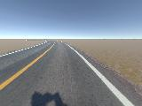
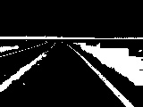
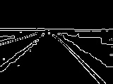
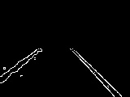
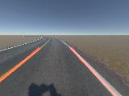
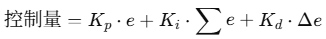

# Donkeycar项目扩展之基于OpenCV库的自动驾驶算法的学习与改进

——在Donkeycar Simulator上使用传统计算机视觉方法，区别于官方方法

学习借鉴了某大佬在CSDN上的发文：[一文掌握基于深度学习的自动驾驶小车开发（Pytorch实现，含完整数据和源码，树莓派+神经计算棒）_深度学习pytorch模型-CSDN博客](https://blog.csdn.net/qianbin3200896/article/details/119832583)

并对其中纯比例的运动决策方式做出改进

## 一、问题分析

​		现在市面上的大部分车型都具备车道保持功能，据我所知，它们几乎都是通过视觉识别车道线得出理论转向角实现的。同样的，我们可以通过颜色空间转换和边缘检测算法，来识别图像中的特征，并将其转化为转向和油门值，对当下的转向和油门值进行微调。这种自动驾驶算法相对基于深度学习的自动驾驶算法的优势在于它不需要提前收集数据和漫长的训练过程。

## 二、原理与实现

### ①	颜色空间转换

在后续图像处理中，图像数据是用 **HSV 颜色空间**（色调 Hue、饱和度 Saturation、亮度 Value）格式表示的，而**不是**使用 RGB 格式。RGB 是计算机显示颜色的方式，而 HSV 更接近人类对颜色的感知方式。在我们的应用中，HSV 中的 **Hue（色调）** 代表“纯色”，不受阴影或光照影响。这让我们可以**更容易地识别颜色**，因为它只涉及一个数值（色调），不需要同时处理 RGB 中的三个数值组合。而 RGB 颜色空间的三个分量都与亮度密切相关，即只要亮度改变，三个分量都会随之相应地改变，所以，RGB 颜色空间适合于显示系统，却并不适合于图像处理。

### ②	特定颜色区域提取

以模拟器中最简易最像真实道路的赛道generated road为例



如图所示，在小车视角中，小车行驶在双向车道的一侧，道路中间的黄色实线和最右侧的白色实线构成了小车的车道，我们希望小车一直运行在这两根线之间。因此，我们首先要定位出这两根线。

需要注意的是：在标准的HSV表示方式中，色调氛围是0到359度，饱和度范围是0到100%，亮度是0到100%。而我们的代码基于OpenCV，它使用的色调值范围是0到179，饱和度和亮度的范围是0到255。

提取黄色区域和白色区域显示为白色，其他区域为黑色



得到的结果如图，还存在不少干扰区域，要进一步处理。


### ③	Canny算法边缘轮廓提取

Canny算法具体包括5个步骤：

1. 使用高斯滤波器，以平滑图像，滤除噪声。
2. 计算图像中每个像素点的梯度强度和方向。
3. 应用非极大值（Non-Maximum Suppression）抑制，以消除边缘检测带来的杂散响应。
4. 应用双阈值（Double-Threshold）检测来确定真实的和潜在的边缘。
5. 通过抑制孤立的弱边缘最终完成边缘检测。

OpenCV中已经集成了Canny算法，直接用就行，将上一步得到的区域图通过Canny算法边缘检测得到：



### ④	ROI感兴趣区域提取

对我们这个模拟平台上的智能小车任务来说，对于黄色行道线，我们只关注图像左下部分，而对于白色行道线，我们只关注图像右下部分即可。至于图像其他部分因为我们通过人工分析知道，图像上部（天空）和较远处的马路，对当下转向和油门决策影响很小。

对黄色区域只保留左下部分，对白色区域只保留右下部分，最后组合为一张图片



### ⑤	基于霍夫变换的线段检测

到目前，我们抽取出了比较精确的行道线轮廓，但是对于实际的自动驾驶任务来说还没有完成目标任务要求，我们要对行道线轮廓再进一步处理，得到行道线的具体线段信息（每条线段的起始点坐标）。

这里我们使用霍夫变换算法检测图像中的直线，并进行聚类和平均得到代表黄色实线的线段和代表白色实线的线段

 霍夫线段检测算法原理步骤如下：

- 初始化(θ,p)空间，N(θ,p)=0 。（N(θ,p)表示在该参数表示的直线上的像素点的个数）
- 对于每一个像素点(x,y)，在参数空间中找出令 xcosθ+ysinθ=p 的(θ,p)坐标，N(θ,p)+=1
- 统计所有N(θ,p)的大小，取出N(θ,p)>threasold的参数 。（threadsold是预设的阈值）

和Canny算法一样，OpenCV已经帮我们集成好了，直接使用就行。

经过聚类平均，得到两条明显的车道线，这里将其画出来。




### ⑥	运动决策

针对前面的测试图片，我们可以有效的检测出两条行道线（左侧黄色线和右侧白色线），但是在真实的运行过程中，可能会出现3种情况：

**(1)正常检测到2条行道线**：这种情况一般是直线车道且车辆稳定运行在行道线内，这时候我们只需要根据检测出的两条行道线微调整角度即可。

**(2)检测出1条行道线**：这种情况在转弯处容易出现，或者在车辆开始大范围偏离时出现，这时候我们的策略应该是向能够检测到的这条行道线方向前进。

**(3)检测不到行道线**：这种情况尝试往后倒退，看能不能重新检测到车道线。


原文中采用的方法是纯比例控制，这里改进增添了PID控制器，详见第三大点：对控制方式的改进。


### ⑦	在模拟器中对小车进行控制

官方在开发gym-donkeycar这一模拟器时，很贴心的提供了Python控制的api，只需要安装驱动库就能直接驱动模拟器里面的小车运行

模拟器项目地址：[tawnkramer/gym-donkeycar: OpenAI gym environment for donkeycar simulator](https://github.com/tawnkramer/gym-donkeycar)

这里解释一下官方给的简单用例（需要提前启动模拟器）：

```python
import gym
import numpy as np

import gym_donkeycar

# 创建模拟器环境
env = gym.make("donkey-warren-track-v0")
# 重置当前场景
obs = env.reset()
try:
    # 进行一百次动作
    for _ in range(100):
        # 转向值为0（方向盘回正），油门值为0.5（正数挂D挡前进，负数挂R挡后退）
        action = np.array([0.0, 0.5])  
        # 将动作action传递给模拟器
        obs, reward, done, info = env.step(action)
except KeyboardInterrupt:
    # CTRL+C暂停
    pass

    # 关闭模拟器
env.close()
```


### 三、对运动决策的改进——增加PID控制器、油门动态调整

#### 1. PID原理

学习文档：[无人车系统（四）：轨迹跟踪PID控制_tracking pid 循迹追踪-CSDN博客](https://blog.csdn.net/u013468614/article/details/103492847?utm_source=chatgpt.com)

PID 是比例（Proportional）、积分（Integral）、微分（Derivative）的缩写。它是控制系统中常用的一种反馈调节方法，用来根据误差（目标 - 当前）动态调整控制变量。

在此处的自动驾驶系统中：

- **目标值** 是车道中心（偏差为 0）
- **当前值** 是车辆相对于车道中心的横向偏移角
- **控制变量** 是方向盘转角（steering）

 PID 的核心计算公式：



- **error** 是当前帧的偏差角（弧度制）
- **integral** 是误差累加，长期偏离会增加修正力度
- **derivative** 是误差变化率，控制“加速度”，防止过冲和震荡

#### 2. 参数调节策略

**先只调 P（比例）**：

- 如果方向猛打，说明 Kp 太大
- 如果车迟钝偏离后才动，Kp 太小

**加入 D（微分）** 抑制方向左右扫动（抗震荡）

**最后再调 I（积分）**，修正长期偏差（如连续一侧偏）


#### 3.油门动态调节

转向越大，速度越低，并非恒定速度以防冲出弯道


#### 4.改动的关键代码

```python
class PIDController:
    def __init__(self, Kp=1.6, Ki=0.01, Kd=0.8):
        self.Kp = Kp
        self.Ki = Ki
        self.Kd = Kd
        self.prev_error = 0
        self.integral = 0

    def reset(self):
        self.prev_error = 0
        self.integral = 0

    def control(self, error):
        self.integral += error
        derivative = error - self.prev_error
        self.prev_error = error
        # 返回计算后的angle
        return self.Kp * error + self.Ki * self.integral + self.Kd * derivative

pid = PIDController()

def get_action(h, w, yellow_lane, white_lane):
    mid = w / 2
    x_offset = 0

    if yellow_lane and white_lane:
        _, _, left_x2, _ = yellow_lane[0][0]
        _, _, right_x2, _ = white_lane[0][0]
        lane_center = (left_x2 + right_x2) / 2
        x_offset = lane_center - mid
    elif yellow_lane:
        x1, _, x2, _ = yellow_lane[0][0]
        x_offset = (x2 - x1) * 0.5  
    elif white_lane:
        x1, _, x2, _ = white_lane[0][0]
        x_offset = (x2 - x1) * 0.5
    else:
        return None

    # 将 x_offset 转换为角度误差（假设 y = h/2）
    y_offset = h / 2
    angle_error = math.atan2(x_offset, y_offset)
    steering = pid.control(angle_error)

    # 限制最大转向幅度
    steering = max(-1.0, min(1.0, steering))

    # 转向越大，速度越低
    throttle = max(0.5, 0.63 * (1 - abs(steering)))
    # throttle = max(0.1, 0.6)
    return np.array([steering, throttle])
```


#### 5. 与原算法的对比分析

|  对比点  |               原算法               |          改进算法          |
| :------: | :--------------------------------: | :------------------------: |
| 控制逻辑 | 简单角度计算 `x_offset / y_offset` |      完整 PID 控制器       |
| 转向控制 |            单一比例控制            |  动态调节，考虑惯性与趋势  |
| 抖动处理 |       无抗抖机制，震荡概率大       | 微分项可抑制过调或反复震荡 |
| 跟踪精度 |        误差持续累积，不修正        |     积分项消除长期偏差     |
| 油门控制 |          恒定 0.6，易冲出          |    根据转向动态调节速度    |
| 实测表现 |      直道稳定，弯道漂移/出轨       |     弯道平稳，响应柔和     |


#### 6. 同屏竞技

##### 规则：

将原算法和改进后的算法在模拟器的同一条道路上进行测试，由于算法在小车上的最终表现不好量化，这里只大致观测在**油门控制相差不大**的情况下，运动决策不同的两辆小车的**运动姿态对比（甩尾、压线行驶、借道行驶）**，而**不是比速度**。冲出赛道的一方直接退出。

##### 油门条件：

原算法无PID小车：恒定油门throttle = 0.6

改进算法有PID小车：throttle = *max*(0.5, 0.63 * (1 - *abs*(steering)))，转向越大，速度越低，最低速度0.5

视频地址：https://www.bilibili.com/video/BV1XNJPzPEfx/


##### 分析：

在视频中可以看到，改进算法后的小车比原算法的小车更能保持在自己车道中，更少发生压线行驶、借道行驶的现象。				


